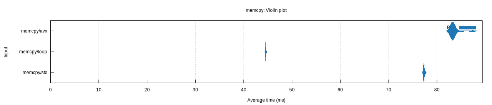
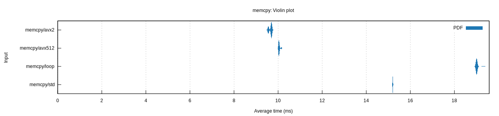
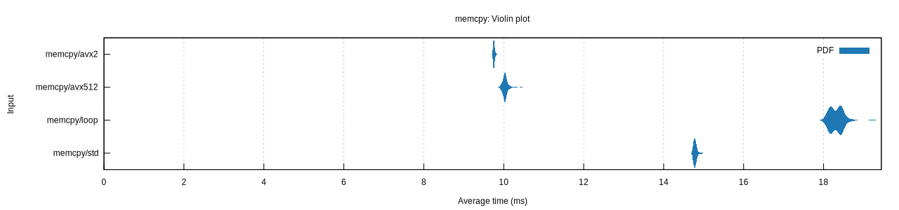

# memcpy

How fast can we `memcpy` 256 MiB of data? Run the benchmarks:

```sh
RUSTFLAGS="-Ctarget-cpu=native" cargo bench
```

## Results

### Intel(R) Xeon(R) CPU E5-2660 v2

DDR3-1866



### AMD EPYC 7713 64-Core Processor

DDR4-3200


### AMD EPYC 9454P 48-Core Processor

DDR5-4800



### AMD Ryzen 7 1800X Eight-Core Processor

DDR4-2133


### AMD Ryzen 9 7950X 16-Core Processor

DDR5-5200



### Apple M1

LPDDR4X-4266


### Apple M1 Pro

LPDDR5-6400


### Apple M2

LPDDR5-6400


### Apple M2 Max

LPDDR5-6400


### Apple M3 Pro

LPDDR5-6400


## May I add my results?

Yes, please!
